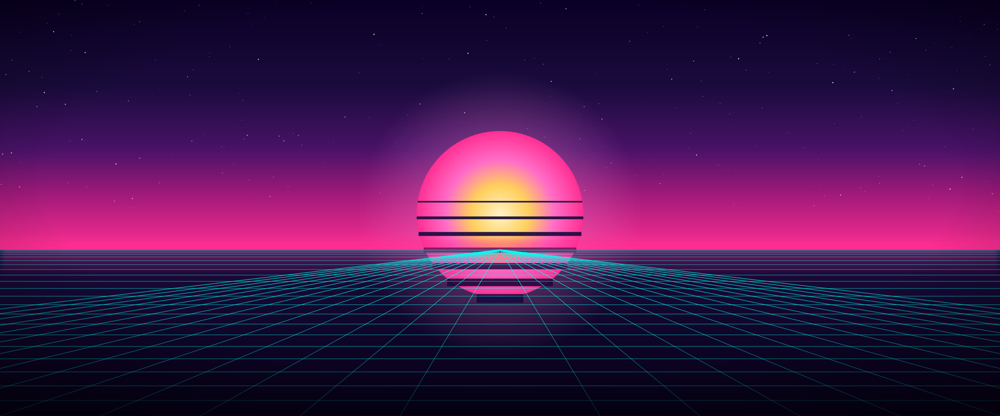

# Vaporwave

A Miami-80s / synthwave [Omarchy](https://omarchy.org) theme: hot pink and
cyan neon, deep purple-black surfaces, an outrun grid-and-sun wallpaper (plus
a skyline alternate), and a companion background plugin that adds a subtle
animated glow and an optional Matrix-style digital rain over the desktop.



## What's in the theme

`colors.toml` drives everything Omarchy themes automatically from one
palette: the top bar, menus, notifications, OSD, lock screen, terminals
(Alacritty/Foot/Ghostty/Kitty), btop, Neovim, Helix, VSCode, Chromium, and
Hyprland's window borders — including a 45° hot-pink-to-cyan gradient border
on the focused window, via the `hyprland_active_border` key.

`backgrounds/` ships two wallpapers:
- `1-outrun-grid.png` — sun-and-grid horizon
- `2-miami-skyline.png` — neon skyline with palms

Cycle between them with `omarchy theme bg next`.

## What's *not* part of the theme (and why)

Omarchy's theme system covers colors, backgrounds, and icons — it doesn't
cover Hyprland's animated wallpaper support (there isn't any; the desktop
background is a static image) or window opacity/rounding/animation curves
(those are user config, not theme-scoped). To get the full look from the
screenshot above, two more pieces are involved:

1. **Animated background** — [omarchy-vaporwave-background](https://github.com/xadacka/omarchy-vaporwave-background),
   a small companion shell plugin (a fork of Omarchy's built-in background
   service) that layers a slow pulsing horizon glow, two crossing neon
   scanlines, and an optional falling-glyph Matrix rain on top of the
   wallpaper. It's a separate plugin, not a theme file, because Omarchy
   themes don't have a slot for animated/composited backgrounds.

2. **Lock screen design** — this theme's colors reach the lock screen
   automatically (Omarchy themes always do), but the specific "Rain" look
   (falling katakana behind the clock) is a *design*, not a color, and comes
   from the third-party [Lock Screen Explorer](https://github.com/SirJul1337/omarchy-lock-explorer)
   plugin. Any lock design works with this theme's colors — Rain is just the
   one used for the preview.

3. **Hyprland flair** — the tighter opacity, rounded corners, and quick
   fade animations in the preview are plain Hyprland look-and-feel settings,
   not theme colors. See `extras/hyprland-flair.lua.sample` if you want to
   match them by hand; the installer doesn't apply this automatically since
   it isn't theme-scoped and could conflict with your existing Hyprland
   config (especially if you manage it with a GUI tool like HyprMod).

## Install

This repo is private, so `omarchy theme install` (which just does a `git
clone`) will work with your own authenticated git/GitHub CLI credentials, but
a plain `curl | bash` one-liner won't. Clone it and run the installer:

```bash
git clone https://github.com/xadacka/omarchy-vaporwave-theme.git /tmp/omarchy-vaporwave-theme
bash /tmp/omarchy-vaporwave-theme/install.sh
```

That installs the theme, applies it, adds and enables the background plugin,
adds the lock screen explorer plugin if you don't already have it, sets the
lock design to Rain, and restarts the Omarchy shell.

### Manual install

If you'd rather do it by hand, or only want part of this:

```bash
# Theme (colors, backgrounds, icons)
omarchy theme install https://github.com/xadacka/omarchy-vaporwave-theme.git
omarchy theme set vaporwave

# Animated background (optional)
omarchy plugin add https://github.com/xadacka/omarchy-vaporwave-background.git --enable

# Rain lock screen design (optional, needs Lock Screen Explorer)
omarchy plugin add https://github.com/SirJul1337/omarchy-lock-explorer.git --enable
omarchy-shell lock setDesign rain

omarchy restart shell
```

## Toggling the animated background

The background plugin's Matrix rain can be switched on or off without
touching any files:

```bash
omarchy-shell background setMatrix false   # plain glow + scanlines only
omarchy-shell background setMatrix true    # bring the rain back
```

The setting persists in `~/.config/omarchy/shell.json` across restarts.

## Uninstall

```bash
omarchy plugin remove io.github.xadacka.vaporwave-background --yes
omarchy plugin remove io.github.sirjul1337.lock-explorer --yes   # only if you don't want it for other themes too
omarchy theme set tokyo-night   # or any other installed theme
```

## License

MIT — see `LICENSE`.
